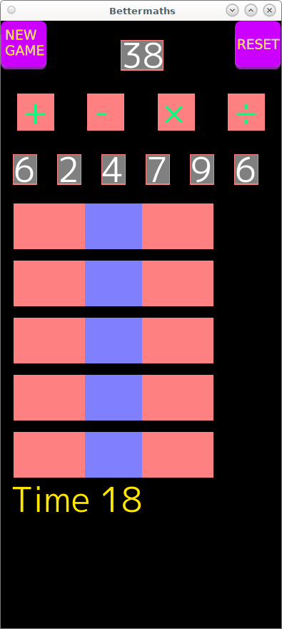
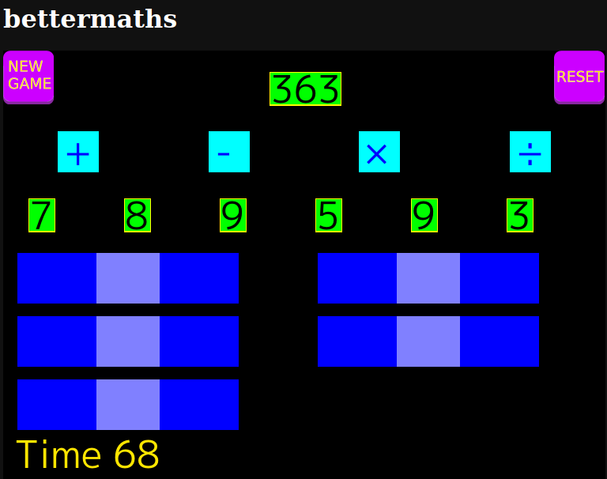

# bettermaths

Learning project while playing with go. Works and tested on Linux,Browser and Android

Developed on desktop(Linux), to run

```
go run desktop.go
```



to build for browser

```
cp $(go env GOROOT)/misc/wasm/wasm_exec.js ./html/wasm_exec.js
GOOS=js GOARCH=wasm go build -o ./html/main.wasm .
cd html
python -m http.server
```
then visit http://127.0.0.1:8000



Also hosted here https://bjason.org/en/go/maths/ 

For Android, you will need Android SDK installed, I had openjdk17 at time of writing as well.

```
cd mobile
ebitenmobile bind  -androidapi 24 -target android -javapkg org.bjason.bettermaths -o ../android/mobilegame/game.aar .
cd ../android
./gradlew installDebug
```


